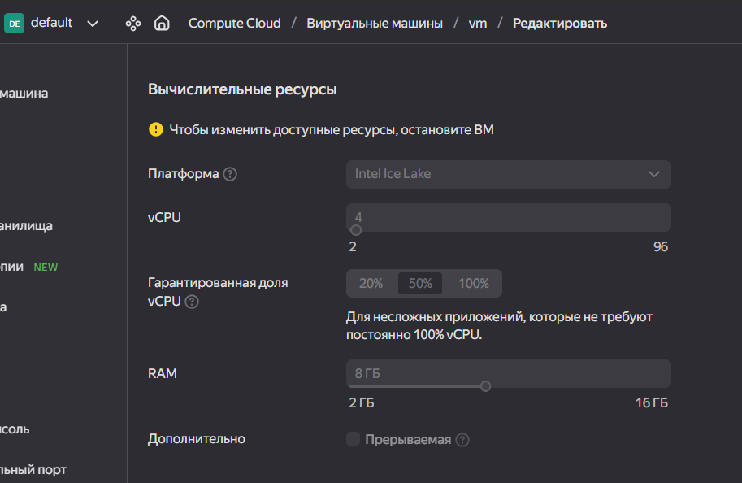
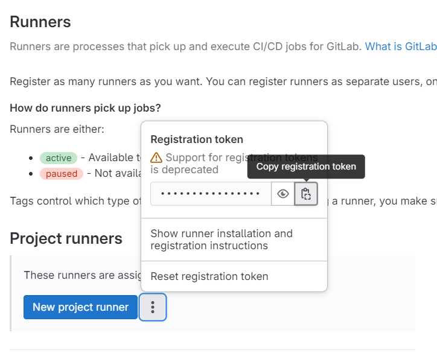

# Навигация 
* [Описание проекта](описание-проекта)
  * [Схема](схема)
* [Настройка окружения](настройка-окружения)
  * [Установка Docker](установка-docker)
  * [Настройка GitLab](настройка-gitlab)
    * [GitLab troubleshooting](gitlab-troubleshooting)
    * [Подключение runner к инстансу GitLab](подключение-runner-к-инстансу-gitlab)
  * [Установка kubectl и minikube](установка-kubectl-и-minikube)
 * [Содержимое проекта](содержимое-проекта)
   * [Описание этапов pipeline-a](описание-этапов-pipeline-a)
  
# Описание проекта
В данном репозитории расположены инструкция и исходные файлы развертывания инфраструктуры для деплоя python-приложения в minikube-кластер посредством GitLab.
Инстанс Gitlab и runner для него разворачивается в Docker на ВМ. На этой же ВМ был поднят minikube-кластер.
## Схема


# Настройка окружения
Все последующие действия производились на виртуальной машине, развернутой в Яндекс.Облако со следующими характеристиками:

## Установка Docker
Установим Docker
```
sudo yum-config-manager --add-repo https://download.docker.com/linux/centos/docker-ce.repo
sudo yum install docker-ce docker-ce-cli containerd.io docker-buildx-plugin docker-compose-plugin
```
Версия Docker
```
[lumi@fhmtps91ba79aa5re88e ~]$ docker --version
Docker version 25.0.3, build 4debf41
```
Добавим пользователя в группу docker
``` sudo usermod -aG docker $USER && newgrp docker ```

Запустим Docker
```systemctl start docker```

## Настройка GitLab
Запустим в Docker экземпляр GitLabCI и GitLab Runner-a c помощью [docker-compose.yml](https://github.com/awesomenmi/demo_project/blob/main/docker-compose.yml)
```
docker-compose up -d
```
Получим пароль администратора от GitLab
```
docker exec -it gitlab gitlab-rake "gitlab:password:reset[root]"
```
### Подключение runner к инстансу GitLab 
Для этого необходимо найти регистрационный токен: _Project -> CI/CD Settings -> Runners_


Зарегистрируем runner
```
[lumi@fhmtps91ba79aa5re88e ~]$ sudo docker exec -it gitlab-runner gitlab-runner register
Runtime platform                                    arch=amd64 os=linux pid=30 revision=656c1943 version=16.9.0
Running in system-mode.

Enter the GitLab instance URL (for example, https://gitlab.com/):
http://x.x.x.x:8080/
Enter the registration token:
***
Enter a description for the runner:
[a5e5fd00c7c7]: docker
Enter tags for the runner (comma-separated):
runner
Enter optional maintenance note for the runner:

WARNING: Support for registration tokens and runner parameters in the 'register' command has been deprecated in GitLab Runner 15.6 and will be replaced with support for authentication tokens. For more information, see https://docs.gitlab.com/ee/ci/runners/new_creation_workflow
Registering runner... succeeded                     runner=GR1348941LZqbxjfZ
Enter an executor: custom, docker, docker-windows, docker+machine, docker-autoscaler, instance, shell, ssh, parallels, virtualbox, kubernetes:
docker
Enter the default Docker image (for example, ruby:2.7):
docker:dind
Runner registered successfully. Feel free to start it, but if it's running already the config should be automatically reloaded!

Configuration (with the authentication token) was saved in "/etc/gitlab-runner/config.toml"
```
> [!NOTE]
> Для того, чтобы runner мог использовать job-ы без тегов, необходимо перейти в настройки необходимого runner-a и поставить галочку _Indicates whether this runner can pick jobs without tags_

## GitLab troubleshooting
_Ошибка:_ **does not appear to be a git repository**
```
Getting source from Git repository
00:00
Fetching changes with git depth set to 20...
Reinitialized existing Git repository in /builds/project-1/.git/
fatal: 'mygitlab/root/my_project.git' does not appear to be a git repository
fatal: Could not read from remote repository.
Please make sure you have the correct access rights
and the repository exists.
ERROR: Job failed: exit code 1
```
_Решение:_
Перейти в Admin Area -> Settings -> General -> Custom Git clone URL for HTTP(S)
И убедиться, что формат URL соответстсвует http://x.x.x.x:8080

_Ошибка:_ **dial tcp: lookup docker on 10.128.0.2:53: no such host**
```
$ docker login -u $REGISTRY_USER -p $REGISTRY_PASS
WARNING! Using --password via the CLI is insecure. Use --password-stdin.
error during connect: Post "http://docker:2375/v1.24/auth": dial tcp: lookup docker on 10.128.0.2:53: no such host
```
_Решение:_
Перейти в контейнер runner-a
```
[lumi@fhmtps91ba79aa5re88e ~]$ docker exec -it gitlab-runner bash
root@4827c84c5b48:/# vi /etc/gitlab-runner/config.toml
```
Отредактировать конфиг ```/etc/gitlab-runner/config.toml```, добавив строчку ```"/var/run/docker.sock:/var/run/docker.sock"``` в _volumes_
Итоговое содержимое файла  ```/etc/gitlab-runner/config.toml```:
```
concurrent = 1
check_interval = 0
connection_max_age = "15m0s"
shutdown_timeout = 0

[session_server]
  session_timeout = 1800

[[runners]]
  name = "docker runner"
  url = "http://x.x.x.x:8080/"
  id = 5
  token = "c9UwQpzP_MJcrgZ8Q-hM"
  token_obtained_at = 2024-02-19T13:20:38Z
  token_expires_at = 0001-01-01T00:00:00Z
  executor = "docker"
  [runners.cache]
    MaxUploadedArchiveSize = 0
  [runners.docker]
    tls_verify = false
    image = "docker:dind"
    privileged = false
    disable_entrypoint_overwrite = false
    oom_kill_disable = false
    disable_cache = false
    volumes = ["/var/run/docker.sock:/var/run/docker.sock","/cache"]
    shm_size = 0
    network_mtu = 0
```

## Установка kubectl и minikube

Скачиваем и устанавливаем kubectl 
```
curl -LO "https://dl.k8s.io/release/$(curl -L -s https://dl.k8s.io/release/stable.txt)/bin/linux/amd64/kubectl"
sudo install -o root -g root -m 0755 kubectl /usr/local/bin/kubectl
kubectl version --client
[lumi@fhmtps91ba79aa5re88e ~]$ kubectl version --client
Client Version: v1.29.2
Kustomize Version: v5.0.4-0.20230601165947-6ce0bf390ce3
```
Скачиваем и устанавливаем kubectl 
```
minicube install
curl -LO https://storage.googleapis.com/minikube/releases/latest/minikube-linux-amd64
sudo install minikube-linux-amd64 /usr/local/bin/minikube
[lumi@fhmtps91ba79aa5re88e ~]$ minikube version
minikube version: v1.32.0
commit: 8220a6eb95f0a4d75f7f2d7b14cef975f050512d
```
Запускаем minikube
```
[lumi@fhmtps91ba79aa5re88e ~]$ minikube start --driver=docker
* minikube v1.32.0 on Centos 7.9.2009 (amd64)
* Using the docker driver based on user configuration
* Using Docker driver with root privileges
* Starting control plane node minikube in cluster minikube
* Pulling base image ...
* Downloading Kubernetes v1.28.3 preload ...
    > preloaded-images-k8s-v18-v1...:  403.35 MiB / 403.35 MiB  100.00% 29.86 M
    > gcr.io/k8s-minikube/kicbase...:  453.90 MiB / 453.90 MiB  100.00% 30.35 M
* Creating docker container (CPUs=2, Memory=2200MB) ...

X Docker is nearly out of disk space, which may cause deployments to fail! (86% of capacity). You can pass '--force' to skip this check.
* Suggestion:

    Try one or more of the following to free up space on the device:

    1. Run "docker system prune" to remove unused Docker data (optionally with "-a")
    2. Increase the storage allocated to Docker for Desktop by clicking on:
    Docker icon > Preferences > Resources > Disk Image Size
    3. Run "minikube ssh -- docker system prune" if using the Docker container runtime
* Related issue: https://github.com/kubernetes/minikube/issues/9024

* Preparing Kubernetes v1.28.3 on Docker 24.0.7 ...
  - Generating certificates and keys ...
  - Booting up control plane ...
  - Configuring RBAC rules ...
* Configuring bridge CNI (Container Networking Interface) ...
  - Using image gcr.io/k8s-minikube/storage-provisioner:v5
* Verifying Kubernetes components...
* Enabled addons: default-storageclass, storage-provisioner
* Done! kubectl is now configured to use "minikube" cluster and "default" namespace by default

* Documentation: https://docs.docker.com/engine/install/linux-postinstall/
```
## Подключение GitLab к k8s через агента

Подключим kubernetes agent server. Для этого необходимо выставить значение параметра `gitlab_kas['enable'] = true` в конфигурационном файле и переконфигурировать GitLab командой `gitlab-ctl reconfigure`

```
[lumi@fhmtps91ba79aa5re88e ~]$ docker exec -it gitlab bash
root@5e01bc6a81bb:/# cat /etc/gitlab/gitlab.rb | grep "gitlab_kas\['enable'\]"
# gitlab_kas['enable'] = true
root@5e01bc6a81bb:/# vi  /etc/gitlab/gitlab.rb
root@5e01bc6a81bb:/# cat /etc/gitlab/gitlab.rb | grep "gitlab_kas\['enable'\]"
gitlab_kas['enable'] = true
root@5e01bc6a81bb:/# gitlab-ctl reconfigure
```
Создадим файл конфигурации агента `.gitlab/agents/k8s-connection/config.yaml` в отдельном сервисном репозитории _k8s-connection_ со следующим содержимым
```
ci_access:
  projects:
    - id: root/my_project
```
Где `root/my_project` - путь до нашего проекта

Затем выберем его при регистрации агента в разделе _Operate -> Kubernetes clusters -> Connect a cluster_ и зарегистрируем агент.

Установим helm
```
[lumi@fhmtps91ba79aa5re88e ~]$ curl https://get.helm.sh/helm-v3.14.2-linux-386.tar.gz -o helm-v3.14.2-linux-386.tar.gz
[lumi@fhmtps91ba79aa5re88e ~]$ sudo mv linux-386/helm /usr/local/bin/helm
[lumi@fhmtps91ba79aa5re88e ~]$ helm version
version.BuildInfo{Version:"v3.14.2", GitCommit:"c309b6f0ff63856811846ce18f3bdc93d2b4d54b", GitTreeState:"clean", GoVersion:"go1.21.7"}
```

Выполним команду, выданную после регистрации агента, на ВМ, где развернут minikube
```
[lumi@fhmtps91ba79aa5re88e ~]$ helm repo add gitlab https://charts.gitlab.io
"gitlab" has been added to your repositories
[lumi@fhmtps91ba79aa5re88e ~]$ helm repo update
Hang tight while we grab the latest from your chart repositories...
...Successfully got an update from the "gitlab" chart repository
Update Complete. ⎈Happy Helming!⎈
[lumi@fhmtps91ba79aa5re88e ~]$ helm upgrade --install k8s-connection gitlab/gitlab-agent \
>     --namespace gitlab-agent-k8s-connection \
>     --create-namespace \
>     --set image.tag=v16.9.2 \
>     --set config.token=glagent-Xdy47-bNjHAATHx8wSh7sXWw7nH4sn6zvEyny64gDQrEFshNnw \
>     --set config.kasAddress=ws://51.250.122.236/-/kubernetes-agent/
Release "k8s-connection" has been upgraded. Happy Helming!
NAME: k8s-connection
LAST DEPLOYED: Fri Mar  1 20:11:13 2024
NAMESPACE: gitlab-agent-k8s-connection
STATUS: deployed
REVISION: 4
TEST SUITE: None
NOTES:
Thank you for installing gitlab-agent.

Your release is named k8s-connection.

## Changelog

### 1.17.0

- The default replica count has been increased from `1` to `2` to allow a zero-downtime upgrade experience.
  You may use `--set replicas=1` to restore the old default behavior.

```

С помощью команды ` kubectl logs -f -l=app.kubernetes.io/name=gitlab-agent -n  gitlab-agent-k8s-connection` можно посмотреть логи агента


# Содержимое проекта
Исходный код приложения [python-demoapp](https://github.com/benc-uk/python-demoapp) добавим в локальный GitLab-проект

Сущности k8s, для последующего разворачивания образа приложения в minicube-кластер 
[deployment.yaml](https://github.com/awesomenmi/demo_project/blob/main/k8s/deployment.yaml)
```
apiVersion: apps/v1
kind: Deployment
metadata:
  name: demo-app-deployment
  labels:
    app: demo-app
spec:
  replicas: 1
  selector:
    matchLabels:
      app: demo-app
  template:
    metadata:
      labels:
        app: demo-app
    spec:
      containers:
      - name: demo-app
        image: luminescencia/demo-app:python-app-1.0
        ports:
        - containerPort: 5000
```
[service.yaml](https://github.com/awesomenmi/demo_project/blob/main/k8s/service.yaml)
```
apiVersion: v1
kind: Service
metadata:
  name: demo-app-service
spec:
  type: NodePort
  selector:
    app: demo-app
  ports:
    - protocol: TCP
      port: 5000
      targetPort: 5000
      nodePort: 30100
```
Для последующего доступа к приложению извне ноды был выбран тип сервиса ```type: NodePort```

## Описание этапов pipeline-a

Код pipelin-a [.gitlab-ci.yml](https://github.com/awesomenmi/demo_project/blob/main/.gitlab-ci.yml)

### test
<details>

<summary>Установка утилиты _make_ и запуск тестов</summary>
Running with gitlab-runner 16.9.0 (656c1943)
  on docker ntBZRsda, system ID: r_Tyz9ItF5DV3n
Preparing the "docker" executor
00:04
Preparing environment
00:00
Running on runner-ntbzrsda-project-1-concurrent-0 via d7051176ef5d...
Getting source from Git repository
00:02
Fetching changes with git depth set to 20...
Reinitialized existing Git repository in /builds/root/my_project/.git/
Checking out bfcbdbaa as detached HEAD (ref is main)...
Skipping Git submodules setup
Executing "step_script" stage of the job script
00:57
Using docker image sha256:c84dbfe3b8deeb39e17d121220107f8354a9083b468a320a77708cd128f11c87 for python:3.9-slim-buster with digest python@sha256:320a7a4250aba4249f458872adecf92eea88dc6abd2d76dc5c0f01cac9b53990 ...
$ apt-get update && apt-get install make
Get:1 http://deb.debian.org/debian buster InRelease [122 kB]
Get:2 http://deb.debian.org/debian-security buster/updates InRelease [34.8 kB]
Get:3 http://deb.debian.org/debian buster-updates InRelease [56.6 kB]
Get:4 http://deb.debian.org/debian buster/main amd64 Packages [7909 kB]
Get:5 http://deb.debian.org/debian-security buster/updates/main amd64 Packages [587 kB]
Get:6 http://deb.debian.org/debian buster-updates/main amd64 Packages [8788 B]
Fetched 8718 kB in 3s (3356 kB/s)
Reading package lists...
Reading package lists...
Building dependency tree...
Reading state information...
Suggested packages:
  make-doc
The following NEW packages will be installed:
  make
0 upgraded, 1 newly installed, 0 to remove and 11 not upgraded.
Need to get 341 kB of archives.
After this operation, 1327 kB of additional disk space will be used.
Get:1 http://deb.debian.org/debian buster/main amd64 make amd64 4.2.1-1.2 [341 kB]
debconf: delaying package configuration, since apt-utils is not installed
Fetched 341 kB in 0s (2609 kB/s)
Selecting previously unselected package make.
(Reading database ... 6843 files and directories currently installed.)
Preparing to unpack .../make_4.2.1-1.2_amd64.deb ...
Unpacking make (4.2.1-1.2) ...
Setting up make (4.2.1-1.2) ...
$ make test
python3 -m venv src/.venv
make: git: Command not found
. src/.venv/bin/activate; pip install -Ur src/requirements.txt
Collecting Flask==2.1.0
  Downloading Flask-2.1.0-py3-none-any.whl (95 kB)
     ━━━━━━━━━━━━━━━━━━━━━━━━━━━━━━━━━━━━━━━ 95.2/95.2 kB 346.6 kB/s eta 0:00:00
Collecting py-cpuinfo==7.0.0
  Downloading py-cpuinfo-7.0.0.tar.gz (95 kB)
     ━━━━━━━━━━━━━━━━━━━━━━━━━━━━━━━━━━━━━━━ 95.9/95.9 kB 937.3 kB/s eta 0:00:00
  Preparing metadata (setup.py): started
  Preparing metadata (setup.py): finished with status 'done'
Collecting psutil==5.8.0
  Downloading psutil-5.8.0-cp39-cp39-manylinux2010_x86_64.whl (293 kB)
     ━━━━━━━━━━━━━━━━━━━━━━━━━━━━━━━━━━━━━━━ 293.5/293.5 kB 3.0 MB/s eta 0:00:00
Collecting gunicorn==20.1.0
  Downloading gunicorn-20.1.0-py3-none-any.whl (79 kB)
     ━━━━━━━━━━━━━━━━━━━━━━━━━━━━━━━━━━━━━━━ 79.5/79.5 kB 318.8 kB/s eta 0:00:00
Collecting black==20.8b1
  Downloading black-20.8b1.tar.gz (1.1 MB)
     ━━━━━━━━━━━━━━━━━━━━━━━━━━━━━━━━━━━━━━━━ 1.1/1.1 MB 24.4 MB/s eta 0:00:00
  Installing build dependencies: started
  Installing build dependencies: finished with status 'done'
  Getting requirements to build wheel: started
  Getting requirements to build wheel: finished with status 'done'
  Preparing metadata (pyproject.toml): started
  Preparing metadata (pyproject.toml): finished with status 'done'
Collecting flake8==3.9.0
  Downloading flake8-3.9.0-py2.py3-none-any.whl (73 kB)
     ━━━━━━━━━━━━━━━━━━━━━━━━━━━━━━━━━━━━━━━━ 73.1/73.1 kB 12.9 MB/s eta 0:00:00
Collecting pytest==6.2.2
  Downloading pytest-6.2.2-py3-none-any.whl (280 kB)
     ━━━━━━━━━━━━━━━━━━━━━━━━━━━━━━━━━━━━━━ 280.1/280.1 kB 44.6 MB/s eta 0:00:00
Collecting werkzeug==2.2.2
  Downloading Werkzeug-2.2.2-py3-none-any.whl (232 kB)
     ━━━━━━━━━━━━━━━━━━━━━━━━━━━━━━━━━━━━━━ 232.7/232.7 kB 15.1 MB/s eta 0:00:00
Collecting click>=8.0
  Downloading click-8.1.7-py3-none-any.whl (97 kB)
     ━━━━━━━━━━━━━━━━━━━━━━━━━━━━━━━━━━━━━━━━ 97.9/97.9 kB 16.6 MB/s eta 0:00:00
Collecting itsdangerous>=2.0
  Downloading itsdangerous-2.1.2-py3-none-any.whl (15 kB)
Collecting Jinja2>=3.0
  Downloading Jinja2-3.1.3-py3-none-any.whl (133 kB)
     ━━━━━━━━━━━━━━━━━━━━━━━━━━━━━━━━━━━━━━ 133.2/133.2 kB 20.0 MB/s eta 0:00:00
Collecting importlib-metadata
  Downloading importlib_metadata-7.0.1-py3-none-any.whl (23 kB)
Requirement already satisfied: setuptools>=3.0 in ./src/.venv/lib/python3.9/site-packages (from gunicorn==20.1.0->-r src/requirements.txt (line 4)) (58.1.0)
Collecting toml>=0.10.1
  Downloading toml-0.10.2-py2.py3-none-any.whl (16 kB)
Collecting regex>=2020.1.8
  Downloading regex-2023.12.25-cp39-cp39-manylinux_2_17_x86_64.manylinux2014_x86_64.whl (773 kB)
     ━━━━━━━━━━━━━━━━━━━━━━━━━━━━━━━━━━━━━━ 773.4/773.4 kB 25.6 MB/s eta 0:00:00
Collecting pathspec<1,>=0.6
  Downloading pathspec-0.12.1-py3-none-any.whl (31 kB)
Collecting typing-extensions>=3.7.4
  Using cached typing_extensions-4.10.0-py3-none-any.whl (33 kB)
Collecting typed-ast>=1.4.0
  Downloading typed_ast-1.5.5-cp39-cp39-manylinux_2_17_x86_64.manylinux2014_x86_64.whl (823 kB)
     ━━━━━━━━━━━━━━━━━━━━━━━━━━━━━━━━━━━━━━ 823.4/823.4 kB 30.9 MB/s eta 0:00:00
Collecting mypy-extensions>=0.4.3
  Downloading mypy_extensions-1.0.0-py3-none-any.whl (4.7 kB)
Collecting appdirs
  Downloading appdirs-1.4.4-py2.py3-none-any.whl (9.6 kB)
Collecting pyflakes<2.4.0,>=2.3.0
  Downloading pyflakes-2.3.1-py2.py3-none-any.whl (68 kB)
     ━━━━━━━━━━━━━━━━━━━━━━━━━━━━━━━━━━━━━━━━ 68.8/68.8 kB 1.4 MB/s eta 0:00:00
Collecting mccabe<0.7.0,>=0.6.0
  Downloading mccabe-0.6.1-py2.py3-none-any.whl (8.6 kB)
Collecting pycodestyle<2.8.0,>=2.7.0
  Downloading pycodestyle-2.7.0-py2.py3-none-any.whl (41 kB)
     ━━━━━━━━━━━━━━━━━━━━━━━━━━━━━━━━━━━━━━━━ 41.7/41.7 kB 1.6 MB/s eta 0:00:00
Collecting pluggy<1.0.0a1,>=0.12
  Downloading pluggy-0.13.1-py2.py3-none-any.whl (18 kB)
Collecting iniconfig
  Downloading iniconfig-2.0.0-py3-none-any.whl (5.9 kB)
Collecting py>=1.8.2
  Downloading py-1.11.0-py2.py3-none-any.whl (98 kB)
     ━━━━━━━━━━━━━━━━━━━━━━━━━━━━━━━━━━━━━━━━ 98.7/98.7 kB 9.4 MB/s eta 0:00:00
Collecting packaging
  Using cached packaging-23.2-py3-none-any.whl (53 kB)
Collecting attrs>=19.2.0
  Downloading attrs-23.2.0-py3-none-any.whl (60 kB)
     ━━━━━━━━━━━━━━━━━━━━━━━━━━━━━━━━━━━━━━━━ 60.8/60.8 kB 7.1 MB/s eta 0:00:00
Collecting MarkupSafe>=2.1.1
  Downloading MarkupSafe-2.1.5-cp39-cp39-manylinux_2_17_x86_64.manylinux2014_x86_64.whl (25 kB)
Collecting zipp>=0.5
  Downloading zipp-3.17.0-py3-none-any.whl (7.4 kB)
Building wheels for collected packages: black
  Building wheel for black (pyproject.toml): started
  Building wheel for black (pyproject.toml): finished with status 'done'
  Created wheel for black: filename=black-20.8b1-py3-none-any.whl size=124171 sha256=395504b32ff8c4c7762c423fe5916c59f9772698fb39090ef45c53bdcdd47d4b
  Stored in directory: /root/.cache/pip/wheels/4e/57/9a/e704bdd859ee892dc46fff03fd499422dc9e99fd9bd5c446d3
Successfully built black
Installing collected packages: py-cpuinfo, mccabe, appdirs, zipp, typing-extensions, typed-ast, toml, regex, pyflakes, pycodestyle, py, psutil, pluggy, pathspec, packaging, mypy-extensions, MarkupSafe, itsdangerous, iniconfig, gunicorn, click, attrs, werkzeug, pytest, Jinja2, importlib-metadata, flake8, black, Flask
  DEPRECATION: py-cpuinfo is being installed using the legacy 'setup.py install' method, because it does not have a 'pyproject.toml' and the 'wheel' package is not installed. pip 23.1 will enforce this behaviour change. A possible replacement is to enable the '--use-pep517' option. Discussion can be found at https://github.com/pypa/pip/issues/8559
  Running setup.py install for py-cpuinfo: started
  Running setup.py install for py-cpuinfo: finished with status 'done'
Successfully installed Flask-2.1.0 Jinja2-3.1.3 MarkupSafe-2.1.5 appdirs-1.4.4 attrs-23.2.0 black-20.8b1 click-8.1.7 flake8-3.9.0 gunicorn-20.1.0 importlib-metadata-7.0.1 iniconfig-2.0.0 itsdangerous-2.1.2 mccabe-0.6.1 mypy-extensions-1.0.0 packaging-23.2 pathspec-0.12.1 pluggy-0.13.1 psutil-5.8.0 py-1.11.0 py-cpuinfo-7.0.0 pycodestyle-2.7.0 pyflakes-2.3.1 pytest-6.2.2 regex-2023.12.25 toml-0.10.2 typed-ast-1.5.5 typing-extensions-4.10.0 werkzeug-2.2.2 zipp-3.17.0
[notice] A new release of pip is available: 23.0.1 -> 24.0
[notice] To update, run: pip install --upgrade pip
touch src/.venv/touchfile
. src/.venv/bin/activate \
&& pytest -v
make: git: Command not found
============================= test session starts ==============================
platform linux -- Python 3.9.17, pytest-6.2.2, py-1.11.0, pluggy-0.13.1 -- /builds/root/my_project/src/.venv/bin/python3
cachedir: .pytest_cache
rootdir: /builds/root/my_project
collecting ... collected 4 items
src/app/tests/test_api.py::test_api_monitor PASSED                       [ 25%]
src/app/tests/test_views.py::test_home PASSED                            [ 50%]
src/app/tests/test_views.py::test_page_content PASSED                    [ 75%]
src/app/tests/test_views.py::test_info PASSED                            [100%]
============================== 4 passed in 3.04s ===============================
Job succeeded
</details>


### build
Сборка Docker-образа и его дальнейшая загрузка в Docker-registry
<details>
<br>Running with gitlab-runner 16.9.0 (656c1943)
<br>  on docker ntBZRsda, system ID: r_Tyz9ItF5DV3n
<br>Preparing the "docker" executor
<br>00:04
Using Docker executor with image docker:dind ...
Pulling docker image docker:dind ...
Using docker image sha256:e5fbe8997fd9ff8f2894874c12a4fbc5fc1bb42d08a7db8433bbe09066562a2a for docker:dind with digest docker@sha256:0d70c541ee98e66b8f7ece8c0e9f7910732466e337a9087c2ac2868ef0775092 ...
Preparing environment
00:01
Running on runner-ntbzrsda-project-1-concurrent-0 via d7051176ef5d...
Getting source from Git repository
00:02
Fetching changes with git depth set to 20...
Reinitialized existing Git repository in /builds/root/my_project/.git/
Checking out bfcbdbaa as detached HEAD (ref is main)...
Removing .pytest_cache/
Removing src/.venv/
Removing src/app/__pycache__/
Removing src/app/tests/__pycache__/
Skipping Git submodules setup
Executing "step_script" stage of the job script
00:11
Using docker image sha256:e5fbe8997fd9ff8f2894874c12a4fbc5fc1bb42d08a7db8433bbe09066562a2a for docker:dind with digest docker@sha256:0d70c541ee98e66b8f7ece8c0e9f7910732466e337a9087c2ac2868ef0775092 ...
$ docker login -u $REGISTRY_USER -p $REGISTRY_PASS
WARNING! Using --password via the CLI is insecure. Use --password-stdin.
WARNING! Your password will be stored unencrypted in /root/.docker/config.json.
Configure a credential helper to remove this warning. See
https://docs.docker.com/engine/reference/commandline/login/#credentials-store
Login Succeeded
$ docker build -t $IMAGE_NAME:$IMAGE_TAG .
#0 building with "default" instance using docker driver
#1 [internal] load build definition from Dockerfile
#1 DONE 0.0s
#1 [internal] load build definition from Dockerfile
#1 transferring dockerfile:
#1 transferring dockerfile: 482B done
#1 DONE 0.8s
#2 [internal] load metadata for docker.io/library/python:3.9-slim-buster
#2 DONE 0.0s
#3 [internal] load .dockerignore
#3 transferring context:
#3 transferring context: 123B done
#3 DONE 0.1s
#4 [1/6] FROM docker.io/library/python:3.9-slim-buster
#4 DONE 0.0s
#5 [internal] load build context
#5 transferring context: 217.28kB done
#5 DONE 0.1s
#6 [2/6] WORKDIR /app
#6 CACHED
#7 [3/6] COPY src/requirements.txt .
#7 CACHED
#8 [4/6] RUN pip install --no-cache-dir -r requirements.txt
#8 CACHED
#9 [5/6] COPY src/run.py .
#9 CACHED
#10 [6/6] COPY src/app ./app
#10 CACHED
#11 exporting to image
#11 exporting layers done
#11 writing image sha256:837aae53468f18cb6fbd05065008b02f1f38344e9b153b448c8e7c4ae13aaca5 done
#11 naming to docker.io/luminescencia/demo-app:1.0 0.0s done
#11 DONE 0.0s
$ docker push $IMAGE_NAME:$IMAGE_TAG
The push refers to repository [docker.io/luminescencia/demo-app]
95ba18b4011d: Preparing
946972809162: Preparing
bd8ddbc8ff65: Preparing
e023d039975e: Preparing
a29091498ccb: Preparing
067ea27560c1: Preparing
7fb1037e08b3: Preparing
14cbeede8d6e: Preparing
ae2d55769c5e: Preparing
e2ef8a51359d: Preparing
067ea27560c1: Waiting
7fb1037e08b3: Waiting
14cbeede8d6e: Waiting
ae2d55769c5e: Waiting
e2ef8a51359d: Waiting
946972809162: Layer already exists
95ba18b4011d: Layer already exists
a29091498ccb: Layer already exists
e023d039975e: Layer already exists
bd8ddbc8ff65: Layer already exists
067ea27560c1: Layer already exists
7fb1037e08b3: Layer already exists
ae2d55769c5e: Layer already exists
14cbeede8d6e: Layer already exists
e2ef8a51359d: Layer already exists
1.0: digest: sha256:606e902b5bd2b346b47529579763e633de4a8628125e5ccf01316c51f3f33415 size: 2411
Job succeeded
</details>

### deploy
Подгрузка контекста с ранее настроеным агентом
Деплой приложения в кластер

 kubectl port-forward svc/demo-app-service --address=0.0.0.0 5000:5000
