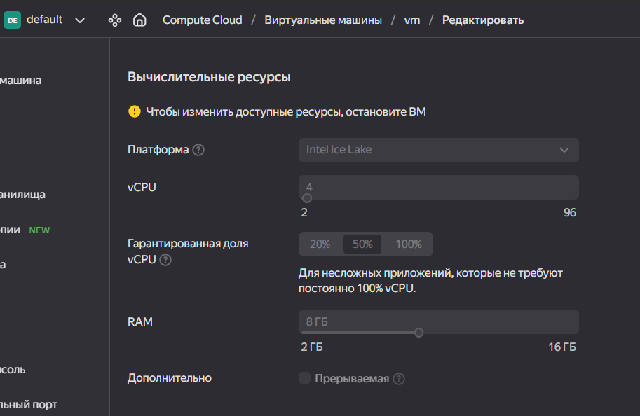

# Навигация 
* [Описание проекта](описание-проекта)
  * [Схема](схема)
* [Настройка окружения](настройка-окружения)
  * [Установка Docker](установка-docker)
  * [Настройка GitLab](настройка-gitlab)
    * [GitLab troubleshooting](gitlab-troubleshooting)
    * [Подключение runner к инстансу GitLab](подключение-runner-к-инстансу-gitlab)
  * [Установка kubectl и minikube](установка-kubectl-и-minikube)
 * [Содержимое проекта](содержимое-проекта)
   * [Описание этапов pipeline-a](описание-этапов-pipeline-a)
  
# Описание проекта
В данном репозитории расположены инструкция и исходные файлы развертывания инфраструктуры для деплоя python-приложения в minikube-кластер посредством GitLab.
Инстанс Gitlab и runner для него разворачивается в Docker на ВМ. На этой же ВМ был поднят minikube-кластер.
## Схема


# Настройка окружения
Все последующие действия производились на виртуальной машине, развернутой в Яндекс.Облако со следующими характеристиками:

## Установка Docker
Установим Docker
```
sudo yum-config-manager --add-repo https://download.docker.com/linux/centos/docker-ce.repo
sudo yum install docker-ce docker-ce-cli containerd.io docker-buildx-plugin docker-compose-plugin
```
Версия Docker
```
[lumi@fhmtps91ba79aa5re88e ~]$ docker --version
Docker version 25.0.3, build 4debf41
```
Добавим пользователя в группу docker
``` sudo usermod -aG docker $USER && newgrp docker ```

Запустим Docker
```systemctl start docker```

## Настройка GitLab
Запустим в Docker экземпляр GitLabCI и GitLab Runner-a c помощью [docker-compose.yml](https://github.com/awesomenmi/demo_project/blob/main/docker-compose.yml)
```
docker-compose up -d
```
Получим пароль администратора от GitLab
```
docker exec -it gitlab gitlab-rake "gitlab:password:reset[root]"
```
### Подключение runner к инстансу GitLab 
Для этого необходимо найти регистрационный токен: _Project -> CI/CD Settings -> Runners_


Зарегистрируем runner
```
[lumi@fhmtps91ba79aa5re88e ~]$ sudo docker exec -it gitlab-runner gitlab-runner register
Runtime platform                                    arch=amd64 os=linux pid=30 revision=656c1943 version=16.9.0
Running in system-mode.

Enter the GitLab instance URL (for example, https://gitlab.com/):
http://x.x.x.x:8080/
Enter the registration token:
***
Enter a description for the runner:
[a5e5fd00c7c7]: docker
Enter tags for the runner (comma-separated):
runner
Enter optional maintenance note for the runner:

WARNING: Support for registration tokens and runner parameters in the 'register' command has been deprecated in GitLab Runner 15.6 and will be replaced with support for authentication tokens. For more information, see https://docs.gitlab.com/ee/ci/runners/new_creation_workflow
Registering runner... succeeded                     runner=GR1348941LZqbxjfZ
Enter an executor: custom, docker, docker-windows, docker+machine, docker-autoscaler, instance, shell, ssh, parallels, virtualbox, kubernetes:
docker
Enter the default Docker image (for example, ruby:2.7):
docker:dind
Runner registered successfully. Feel free to start it, but if it's running already the config should be automatically reloaded!

Configuration (with the authentication token) was saved in "/etc/gitlab-runner/config.toml"
```
> [!NOTE]
> Для того, чтобы runner мог использовать job-ы без тегов, необходимо перейти в настройки необходимого runner-a и поставить галочку _Indicates whether this runner can pick jobs without tags_

## GitLab troubleshooting
_Ошибка:_ **does not appear to be a git repository**
```
Getting source from Git repository
00:00
Fetching changes with git depth set to 20...
Reinitialized existing Git repository in /builds/project-1/.git/
fatal: 'mygitlab/root/my_project.git' does not appear to be a git repository
fatal: Could not read from remote repository.
Please make sure you have the correct access rights
and the repository exists.
ERROR: Job failed: exit code 1
```
_Решение:_
Перейти в Admin Area -> Settings -> General -> Custom Git clone URL for HTTP(S)
И убедиться, что формат URL соответстсвует http://x.x.x.x:8080

_Ошибка:_ **dial tcp: lookup docker on 10.128.0.2:53: no such host**
```
$ docker login -u $REGISTRY_USER -p $REGISTRY_PASS
WARNING! Using --password via the CLI is insecure. Use --password-stdin.
error during connect: Post "http://docker:2375/v1.24/auth": dial tcp: lookup docker on 10.128.0.2:53: no such host
```
_Решение:_
Перейти в контейнер runner-a
```
[lumi@fhmtps91ba79aa5re88e ~]$ docker exec -it gitlab-runner bash
root@4827c84c5b48:/# vi /etc/gitlab-runner/config.toml
```
Отредактировать конфиг ```/etc/gitlab-runner/config.toml```, добавив строчку ```"/var/run/docker.sock:/var/run/docker.sock"``` в _volumes_
Итоговое содержимое файла  ```/etc/gitlab-runner/config.toml```:
```
concurrent = 1
check_interval = 0
connection_max_age = "15m0s"
shutdown_timeout = 0

[session_server]
  session_timeout = 1800

[[runners]]
  name = "docker runner"
  url = "http://51.250.122.204:8080/"
  id = 5
  token = "c9UwQpzP_MJcrgZ8Q-hM"
  token_obtained_at = 2024-02-19T13:20:38Z
  token_expires_at = 0001-01-01T00:00:00Z
  executor = "docker"
  [runners.cache]
    MaxUploadedArchiveSize = 0
  [runners.docker]
    tls_verify = false
    image = "docker:dind"
    privileged = false
    disable_entrypoint_overwrite = false
    oom_kill_disable = false
    disable_cache = false
    volumes = ["/var/run/docker.sock:/var/run/docker.sock","/cache"]
    shm_size = 0
    network_mtu = 0
```

## Установка kubectl и minikube

Скачиваем и устанавливаем kubectl 
```
curl -LO "https://dl.k8s.io/release/$(curl -L -s https://dl.k8s.io/release/stable.txt)/bin/linux/amd64/kubectl"
sudo install -o root -g root -m 0755 kubectl /usr/local/bin/kubectl
kubectl version --client
[lumi@fhmtps91ba79aa5re88e ~]$ kubectl version --client
Client Version: v1.29.2
Kustomize Version: v5.0.4-0.20230601165947-6ce0bf390ce3
```
Скачиваем и устанавливаем kubectl 
```
minicube install
curl -LO https://storage.googleapis.com/minikube/releases/latest/minikube-linux-amd64
sudo install minikube-linux-amd64 /usr/local/bin/minikube
[lumi@fhmtps91ba79aa5re88e ~]$ minikube version
minikube version: v1.32.0
commit: 8220a6eb95f0a4d75f7f2d7b14cef975f050512d
```
Запускаем minikube
```
[lumi@fhmtps91ba79aa5re88e ~]$ minikube start --driver=docker
* minikube v1.32.0 on Centos 7.9.2009 (amd64)
* Using the docker driver based on user configuration
* Using Docker driver with root privileges
* Starting control plane node minikube in cluster minikube
* Pulling base image ...
* Downloading Kubernetes v1.28.3 preload ...
    > preloaded-images-k8s-v18-v1...:  403.35 MiB / 403.35 MiB  100.00% 29.86 M
    > gcr.io/k8s-minikube/kicbase...:  453.90 MiB / 453.90 MiB  100.00% 30.35 M
* Creating docker container (CPUs=2, Memory=2200MB) ...

X Docker is nearly out of disk space, which may cause deployments to fail! (86% of capacity). You can pass '--force' to skip this check.
* Suggestion:

    Try one or more of the following to free up space on the device:

    1. Run "docker system prune" to remove unused Docker data (optionally with "-a")
    2. Increase the storage allocated to Docker for Desktop by clicking on:
    Docker icon > Preferences > Resources > Disk Image Size
    3. Run "minikube ssh -- docker system prune" if using the Docker container runtime
* Related issue: https://github.com/kubernetes/minikube/issues/9024

* Preparing Kubernetes v1.28.3 on Docker 24.0.7 ...
  - Generating certificates and keys ...
  - Booting up control plane ...
  - Configuring RBAC rules ...
* Configuring bridge CNI (Container Networking Interface) ...
  - Using image gcr.io/k8s-minikube/storage-provisioner:v5
* Verifying Kubernetes components...
* Enabled addons: default-storageclass, storage-provisioner
* Done! kubectl is now configured to use "minikube" cluster and "default" namespace by default

* Documentation: https://docs.docker.com/engine/install/linux-postinstall/
```
## Подключение GitLab к k8s через агента
Создадим файл конфигурации агента .gitlab/agents/k8s-connection/config.yaml
Затем выберем его при регистрации агента в разделе _Operate -> Kubernetes clusters -> Connect a cluster_ и зарегистрируем агент.

Подключим kubernetes agent server. Для этого необходимо выставить значение параметра `gitlab_kas['enable'] = true` в конфигурационном файле

```
[lumi@fhmtps91ba79aa5re88e ~]$ docker exec -it gitlab bash
root@5e01bc6a81bb:/# cat /etc/gitlab/gitlab.rb | grep "gitlab_kas\['enable'\]"
# gitlab_kas['enable'] = true
root@5e01bc6a81bb:/# vi  /etc/gitlab/gitlab.rb
root@5e01bc6a81bb:/# cat /etc/gitlab/gitlab.rb | grep "gitlab_kas\['enable'\]"
gitlab_kas['enable'] = true
root@5e01bc6a81bb:/# gitlab-ctl reconfigure
```

Установим helm
```
[lumi@fhmtps91ba79aa5re88e ~]$ curl https://get.helm.sh/helm-v3.14.2-linux-386.tar.gz -o helm-v3.14.2-linux-386.tar.gz
[lumi@fhmtps91ba79aa5re88e ~]$ sudo mv linux-386/helm /usr/local/bin/helm
[lumi@fhmtps91ba79aa5re88e ~]$ helm version
version.BuildInfo{Version:"v3.14.2", GitCommit:"c309b6f0ff63856811846ce18f3bdc93d2b4d54b", GitTreeState:"clean", GoVersion:"go1.21.7"}
```

Выполним команду, выданную после регистрации агента, на ВМ, где развернут minikube
```
[lumi@fhmtps91ba79aa5re88e ~]$ helm repo add gitlab https://charts.gitlab.io
"gitlab" has been added to your repositories
[lumi@fhmtps91ba79aa5re88e ~]$ helm repo update
Hang tight while we grab the latest from your chart repositories...
...Successfully got an update from the "gitlab" chart repository
Update Complete. ⎈Happy Helming!⎈
[lumi@fhmtps91ba79aa5re88e ~]$ helm upgrade --install k8s-connection gitlab/gitlab-agent \
>     --namespace gitlab-agent-k8s-connection \
>     --create-namespace \
>     --set image.tag=v16.9.2 \
>     --set config.token=glagent-Xdy47-bNjHAATHx8wSh7sXWw7nH4sn6zvEyny64gDQrEFshNnw \
>     --set config.kasAddress=ws://51.250.122.236/-/kubernetes-agent/
Release "k8s-connection" has been upgraded. Happy Helming!
NAME: k8s-connection
LAST DEPLOYED: Fri Mar  1 20:11:13 2024
NAMESPACE: gitlab-agent-k8s-connection
STATUS: deployed
REVISION: 4
TEST SUITE: None
NOTES:
Thank you for installing gitlab-agent.

Your release is named k8s-connection.

## Changelog

### 1.17.0

- The default replica count has been increased from `1` to `2` to allow a zero-downtime upgrade experience.
  You may use `--set replicas=1` to restore the old default behavior.

```

С помощью команды ` kubectl logs -f -l=app.kubernetes.io/name=gitlab-agent -n  gitlab-agent-k8s-connection` можно посмотреть логи агента


# Содержимое проекта
Исходный код приложения [python-demoapp](https://github.com/benc-uk/python-demoapp) добавим в локальный GitLab-проект

Сущности k8s, для последующего разворачивания образа приложения в minicube-кластер 
[deployment.yaml](https://github.com/awesomenmi/demo_project/blob/main/k8s/deployment.yaml)
```
apiVersion: apps/v1
kind: Deployment
metadata:
  name: demo-app-deployment
  labels:
    app: demo-app
spec:
  replicas: 1
  selector:
    matchLabels:
      app: demo-app
  template:
    metadata:
      labels:
        app: demo-app
    spec:
      containers:
      - name: demo-app
        image: luminescencia/demo-app:python-app-1.0
        ports:
        - containerPort: 5000
```
[service.yaml](https://github.com/awesomenmi/demo_project/blob/main/k8s/service.yaml)
```
apiVersion: v1
kind: Service
metadata:
  name: demo-app-service
spec:
  type: NodePort
  selector:
    app: demo-app
  ports:
    - protocol: TCP
      port: 5000
      targetPort: 5000
      nodePort: 30100
```
Для последующего доступа к приложению извне ноды был выбран тип сервиса ```type: NodePort```

## Описание этапов pipeline-a

Код pipelin-a [.gitlab-ci.yml](https://github.com/awesomenmi/demo_project/blob/main/.gitlab-ci.yml)

 kubectl port-forward svc/demo-app-service --address=0.0.0.0 5000:5000
